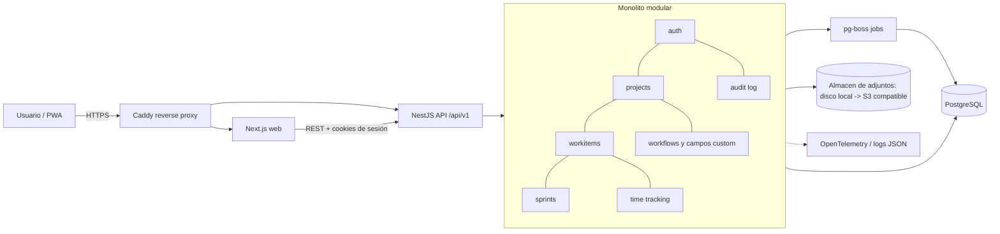

# Arquitectura: Nexus ("Track your goals, drive your moves.")

> **Nombre oficial:** Nexus  
> **Slogan:** *Track your goals, drive your moves.*

## 1. Resumen de la idea
Aplicación web propia para administrar proyectos personales y laborales de TI, con soporte para Kanban, Scrum, gestión tradicional (PMI) y flujos personalizados ("tropicalizados"). Uso inicial: Jorge + pocos colaboradores. Hosting local ahora, migración posterior a un destino aún no definido. Maneja datos laborales de sensibilidad alta.

## 2. Alcance definido
- **Incluido en MVP:**
  - Workspaces, proyectos (tipo personal/laboral) y plantillas de metodología (Kanban, Scrum, PMI, Custom).
  - Work items (épica, historia, tarea, bug, hito, riesgo) con estados configurables.
  - Tablero Kanban, backlog y sprints, vista lista, vista Gantt/hitos básica.
  - Campos personalizados por proyecto.
  - Comentarios, etiquetas, adjuntos, registro de tiempo.
  - Auth con roles por proyecto, MFA (TOTP), auditoría.
  - Exportación de datos (CSV/JSON).
- **Fuera de alcance (por ahora):** tiempo real colaborativo, app nativa, integraciones (Azure DevOps, Jira, Teams), IA, facturación, multi-organización.
- **Supuestos asumidos:**
  - Escala: 1-10 usuarios, miles de work items.
  - API consumida solo por el frontend propio (pero documentada con OpenAPI para abrirla luego).
  - Madurez: MVP evolutivo que pasa a uso real desde temprano, por lo que la seguridad se implementa desde el día 1.
  - Idioma de UI: español (i18n preparado para inglés).

## 3. Stack recomendado
| Capa | Tecnología | Por qué |
|---|---|---|
| Frontend | Next.js (React) + TypeScript, Tailwind + shadcn/ui, TanStack Query, dnd-kit | Ecosistema maduro, PWA posible, buen soporte de drag & drop para tableros. |
| Backend | NestJS (TypeScript), REST + OpenAPI, validación con Zod/class-validator | Estructura modular impuesta por el framework; cabe un monolito modular que crece por módulos. |
| Base de datos | PostgreSQL 16 + Prisma (o Drizzle) | Relacional para proyectos/dependencias; JSONB para campos personalizados; cifrado con pgcrypto para campos sensibles. |
| Cola/tareas | pg-boss (sobre Postgres) | Jobs (recordatorios, exportes) sin agregar Redis. |
| Auth | Sesiones httpOnly + argon2id + TOTP; abstracción para agregar OIDC (Entra ID, Google) después | Seguro para datos sensibles y portable. |
| Infraestructura | Docker Compose local (web, api, db) + Caddy con HTTPS local (mkcert) | Portable a Azure, VPS o Kubernetes sin reescribir. |
| Observabilidad | Pino (logs JSON) + OpenTelemetry SDK + `/health` | Listo para conectar a cualquier backend de telemetría al migrar. |
| Testing | Vitest, Testcontainers (integración con Postgres real), Playwright (E2E) | Cubre dominio, API y flujos críticos. |
| CI | GitHub Actions (lint, test, audit de dependencias, SBOM) | Seguridad de cadena de suministro desde el inicio. |

## 4. Patrón de arquitectura
**Monolito modular con Clean/Hexagonal por módulo** (domain, application, infrastructure, interface).

Por qué para este caso: es un solo desarrollador con pocos usuarios, así que microservicios son sobrecosto puro. Pero los límites entre módulos (projects, workitems, sprints, workflows, auth, audit) están explícitos, de modo que cualquiera pueda extraerse a servicio después si hace falta. La "tropicalización" se resuelve con un **motor de workflows y campos configurables por datos** (no por código): metodología = plantilla de estados + tipos de item + campos + reglas.

## 5. Diagrama


## 6. Estructura de carpetas y archivos
```
nexus/
├── apps/
│   ├── web/                      # Frontend Next.js
│   │   ├── src/app/              # Rutas (App Router)
│   │   ├── src/features/         # Un folder por dominio: projects, board, sprints, gantt
│   │   ├── src/components/ui/    # Componentes shadcn/ui reutilizables
│   │   ├── src/lib/              # Cliente API, i18n, utilidades
│   │   └── tests/e2e/            # Playwright
│   └── api/                      # Backend NestJS
│       ├── src/modules/
│       │   ├── auth/             # Login, sesiones, MFA, RBAC
│       │   ├── projects/         # Proyectos, portafolios, plantillas
│       │   ├── workitems/        # Épicas, historias, tareas, riesgos, hitos
│       │   ├── sprints/          # Sprints, backlog, velocidad
│       │   ├── workflows/        # Estados, transiciones, campos personalizados
│       │   ├── timetracking/     # Registro de tiempo
│       │   ├── attachments/      # Adjuntos (puerto + adaptador de almacenamiento)
│       │   └── audit/            # Bitacora de auditoria
│       ├── src/shared/           # Config, logging, errores, guards, interceptores
│       ├── prisma/               # Esquema y migraciones
│       └── test/                 # Integración con Testcontainers
├── packages/
│   └── contracts/                # Esquemas Zod y tipos compartidos web/api
├── infra/
│   ├── docker/                   # Dockerfiles
│   ├── caddy/                    # Caddyfile
│   └── compose.yml               # Orquestación local
├── docs/
│   ├── adr/                      # Decisiones de arquitectura (ADRs)
│   └── security.md               # Modelo de amenazas y controles
├── .github/workflows/            # CI
├── .env.example                  # Sin secretos reales
└── CLAUDE.md                     # Contexto para Claude Code
```

**Entidades núcleo:** Workspace, User, Membership(rol), Project(tipo, plantilla), WorkflowTemplate(estados, transiciones), WorkItem(tipo, padre, estado, custom_fields JSONB), Sprint, Milestone, Dependency, Risk, TimeEntry, Comment, Attachment, Label, CustomFieldDefinition, AuditLog.

## 7. Checklist de evaluación (11 dominios)
| # | Dominio | Estado | Notas |
|---|---|---|---|
| 1 | Alcance y requisitos | ✅ | Metodologías y sensibilidad confirmadas; MVP acotado. |
| 2 | Modelo de datos | ⚠️ | Entidades propuestas; validar el modelo de campos custom y dependencias con casos reales. |
| 3 | Auth/Authz | ✅ | Roles por proyecto, MFA, colaboradores confirmados. OIDC como fase 2. |
| 4 | Diseño de API | ⚠️ | REST + OpenAPI; solo consumidor propio (asumido). |
| 5 | Arquitectura frontend | ⚠️ | SPA/SSR híbrido con PWA; sin decisión de modo offline. |
| 6 | Escalabilidad/performance | ✅ | Baja escala; índices y paginación bastan. |
| 7 | Seguridad (OWASP) | ✅ | Ver requisitos de seguridad del prompt final; datos altos: cifrado de campos, auditoría, secretos fuera del repo. |
| 8 | Infraestructura/deploy | ❌ | Nube destino indefinida. Diseño portable con Docker; decidir antes de migrar. |
| 9 | Observabilidad/logging | ⚠️ | Logs estructurados y OTel listos; sin backend de telemetría elegido. |
| 10 | Testing | ✅ | Unit + integración + E2E en flujos críticos. |
| 11 | Costo/complejidad | ✅ | Monolito, un solo motor de datos, cero servicios externos de pago en MVP. |

## 8. Trade-offs y alternativas consideradas
- **Next.js full-stack (sin backend separado):** menos piezas y más rápido de arrancar. Descartado porque acopla la lógica al frontend, dificulta abrir la API a integraciones futuras y el modelo de módulos/permisos queda menos explícito. Es la alternativa válida si se prioriza velocidad sobre extensibilidad.
- **Microservicios / arquitectura orientada a eventos:** sobrecosto operativo injustificado para 1-10 usuarios. El monolito modular deja el camino abierto.
- **Usar Jira/Azure DevOps/Plane (open source) en lugar de construir:** más barato, pero no permite la "tropicalización" profunda ni el aprendizaje. Vale considerar Plane como referencia de funcionalidades.
- **Redis para colas/caché:** descartado en MVP; pg-boss sobre Postgres reduce piezas.
- **NoSQL (Mongo):** descartado; el dominio es fuertemente relacional (jerarquías, dependencias, sprints). JSONB cubre la flexibilidad necesaria.
- **Costo principal aceptado:** el motor de workflows/campos configurables es la parte más compleja; se limita en MVP a estados, tipos y campos simples (sin reglas de automatización).

## 9. Historial de cambios y bitácora de implementación

**Fecha de corte:** 2026-10-01

### Historial de cambios (Changelog)

#### Actualización 2026-10-01 (Centro de Mando Ejecutivo, Gestión de Equipos, Edición de Tareas, Calendario y Menú Superior)

1. **Reestructuración de Layout a Menú Superior (*Top Navbar*) y Distribución Fluida al 100%:**
   - **Eliminación del Sidebar lateral:** Se removió la barra lateral izquierda de 260px que consumía ancho horizontal valioso y generaba asimetría visual en pantallas de alta resolución.
   - **Implementación de barra superior fija (*Top Navbar*):** Cabecera horizontal persistente con efecto translúcido (*backdrop-filter / glassmorphism*) que unifica la identidad de marca, navegación principal y utilidades de sesión.
   - **Componentes integrados en el menú superior:**
     - Identidad de marca (Logo oficial `logobase01.png` + isotipo "Nexus").
     - Pestañas de navegación con contadores y badges dinámicos en tiempo real: **Mis Proyectos**, **Agenda & Calendario**, y **Tablero Kanban**.
     - Conmutador de tema de iluminación Día / Noche con persistencia y animación fluida.
     - Indicador y avatar del usuario activo con su rol general.
     - Botón de cierre de sesión seguro (*Logout*).
   - **Aprovechamiento del 100% del espacio:** Contenedor de trabajo principal (`.dashboard-content-wrap`) configurado a ancho completo fluido sin desbordamientos horizontales, brindando máxima visibilidad tanto para matrices de proyectos y cronogramas como para el tablero de tareas.

2. **Identidad Corporativa e Integración Oficial de Logo:**
   - **Incorporación de isotipo corporativo:** Se integró el logotipo oficial `logobase01.png` (proveniente de `C:\DevJlcc\ProjectM\Logos`), desplegado en `apps/web/public/logobase01.png`.
   - **Proporción y escala visual armonizada:** Ajuste de dimensiones relativas y espaciados respecto al texto de encabezado en la pantalla de bienvenida/login (`brand-hero-logo`), en la barra de navegación superior y en el encabezado de todas las ventanas modales de la plataforma.

3. **Edición Integral y Eliminación Segura de Tareas (*Work Items*):**
   - **Habilitación de edición de tareas existentes:** Se convirtió el catálogo de tareas en entidades totalmente mutables, accesibles mediante botón de edición (ícono de lápiz en cabecera de tarjeta y títulos clickeables) tanto desde el Tablero Kanban como desde las 3 vistas de la Agenda (Día, Semana, Mes).
   - **Modal interactivo "Editar Tarea o Compromiso":** Formulario reactivo que permite modificar:
     - Proyecto asociado al ítem.
     - Título y descripción detallada del compromiso.
     - Tipo de ejecutor: Mío (personal), Miembro interno del equipo (con selector de colaboradores del proyecto) o Proveedor externo (con autocompletado datalist de terceros vinculados).
     - Fecha límite de entrega (*due date*).
     - Metodología / Tipo (tarea, historia, bug, hito, riesgo).
     - Nivel de prioridad (baja, media, alta, urgente).
     - Estado dentro del flujo de trabajo (backlog, in_progress, review, done).
   - **Eliminación segura con confirmación:** Integración del botón de borrado destructivo con modal de alerta y confirmación explícita para evitar pérdidas involuntarias de datos.
   - **Endpoints REST en backend:** Implementación de `PUT /api/work-items/:id` con validación Zod integral y `DELETE /api/work-items/:id` en la capa de servicios de `apps/api`.
   - **Rediseño del botón de cierre (**X**) de modales:** Reubicación absoluta en la esquina superior derecha (`top: 14px`, `right: 14px`), diseño tipo botón elevado con hover animado e iconografía vectorial SVG limpia (`<Icons.Close />`).

4. **Navegación Histórica y Rango Flexible en Calendario Semanal:**
   - **Navegación temporal entre semanas:** Controles dedicados `‹ Semana Anterior`, `Esta Semana` (con resaltado de semana en curso) y `Semana Siguiente ›`, permitiendo auditar compromisos pasados o planificar semanas futuras.
   - **Indicador de rango dinámico:** Cabecera informativa que muestra el rango de fechas exacto (ej. *28 sep – 2 oct 2026*).
   - **Selector de modalidad 5 Días vs 7 Días:** Conmutador segmentado para alternar entre vista laboral (Lunes a Viernes) y vista semanal completa (Lunes a Domingo), facilitando la gestión de guardias, despliegues de fin de semana o soporte de terceros.

5. **Gestión Avanzada de Equipos y Roles de Proyecto:**
   - **Estructura ampliada de participantes (`teamMembers`):** Soporte de integrantes con roles diferenciados: `admin` (Administrador), `collaborator` (Colaborador interno), `vendor` (Proveedor o contratista externo) y `viewer` (Observador/Stakeholder).
   - **API REST especializada:** Endpoints `POST`, `PUT` y `DELETE` bajo la ruta `/api/projects/:id/members`.
   - **Modal interactivo de administración de equipo:** Búsqueda y filtrado por rol, incorporación de nuevos miembros, edición rápida del rol in-situ y revocación de accesos.
   - **Compatibilidad bidireccional:** Sincronización automática con los arreglos históricos `admins` y `members` para evitar regresiones de datos.

6. **Centro de Mando Ejecutivo & Agenda Temporal Unificada:**
   - **Proyectos ejecutivos:** Roles de liderazgo (`lead` / `collaborator`), fecha meta de entrega (*target date*), métricas consolidadas (KPIs), cálculo automático de progreso porcentual y semáforo visual de tareas pendientes propias versus del equipo.
   - **Agenda temporal multidimensional:** Vistas de **Día** (categorizado en atrasadas, hoy y próximas), **Semana** (con navegación continua) y **Mes** (calendario interactivo con visor de compromisos por día).

7. **Rediseño Ejecutivo del Dashboard y de Tarjetas de Proyecto:**
   - **Tarjetas KPI métricas:** Disposición horizontal con ícono a la izquierda, valor numérico agrandado y título/subtítulo organizados jerárquicamente a la derecha.
   - **Reorganización ergonómica de la tarjeta de proyecto:**
     - Etapa del proyecto (`.project-stage-pill`) destacada en la parte superior izquierda con ícono vectorial SVG y selector interactivo.
     - Botón de gestión de equipo (`.project-team-gear-btn`) con el ícono vectorial FontAwesome 6 `fa-users-gear` ubicado directamente debajo de la etapa.
     - Botón de eliminación compacto en la esquina inferior izquierda (`.project-compact-icon-btn`) junto al botón de edición del proyecto (`.project-btn-edit`).
     - Modal de edición integral de proyectos (`PUT /api/projects/:id`) para actualizar nombre, descripción, plantilla, rol y fecha objetivo.
     - Botón de acceso directo al Tablero Kanban en la parte superior derecha (`.project-btn-board`).

8. **Navegación Bidireccional Ágil y Retorno al Proyecto desde el Tablero Kanban:**
   - **Botón de retorno rápido en cabecera:** Se incorporaron botones dedicados `[ ← Volver a Mis Proyectos ]` tanto en el panel de acciones superior como en el sub-encabezado de navegación del Tablero Kanban.
   - **Focalización y scroll suave automático:** Al pulsar en retornar, la interfaz conmuta instantáneamente a la vista "Mis Proyectos", ajusta los filtros activos en caso de que el proyecto estuviese oculto, y realiza un desplazamiento suave (`scrollIntoView`) centrando la tarjeta del proyecto en pantalla.
   - **Resaltado visual transitorio (*Pulse Glow*):** La tarjeta del proyecto de origen se ilumina con una animación elegante de pulso perimetral azul celeste (`.project-card--highlight`) que guía de inmediato la atención del usuario hacia el proyecto que estaba consultando.

9. **Modernización de Notificaciones, Alineación y Temporizador Automático (10s):**
   - **Diseño de banner de estado:** Reestructuración a flexbox con ícono temático (Check para éxito, Alert para error), mensaje destacado y botón de cierre (`<Icons.Close />`) perfectamente alineado en el extremo derecho superior con micro-animaciones en hover.
   - **Temporizador de auto-cierre a los 10 segundos:** Se integró un ciclo reactivo (`useEffect`) que cierra automáticamente la notificación tras 10 segundos (`10000ms`), cancelando temporizadores previos ante nuevas alertas o al cerrarse manualmente.
   - **Indicador sutil de progreso:** Barra animada en el borde inferior que refleja con suavidad el conteo de los 10 segundos antes de ocultarse.

10. **Soporte de Múltiples Ejecutores y Personas Asignadas por Tarea:**
    - **Modelo de datos y endpoints enriquecidos:** Se extendió el tipo `WorkItem` y los esquemas Zod (`POST /api/work-items`, `PUT /api/work-items/:id`) para admitir la colección `assignees: string[]` con sincronización bidireccional y retrocompatibilidad con `assignee: string`.
    - **Selector interactivo multi-ejecutor (`TaskAssigneesSelector`):**
      - Visualización de responsables asignados como etiquetas tipo chip con botón de remoción rápida (`×`).
      - Botones de selección rápida con estado activo (`✓`) o agregar (`+`) para el usuario líder (`Jorge (Yo)`), administradores, colaboradores y proveedores del proyecto.
      - Campo de texto libre para añadir al vuelo cualquier nuevo colaborador, consultor o tercero con la tecla Enter o el botón `+ Añadir`.
    - **Visualización en tarjetas e insignias:** `AssigneeBadge` ahora renderiza chips múltiples organizados con íconos vectoriales diferenciados por rol (personal, equipo interno o proveedor).
    - **Filtros compartidos en Agenda y Kanban:** Los filtros por ejecutor ('Solo mías', 'Equipo', 'Proveedores') identifican y muestran correctamente tareas asignadas a varias personas de forma simultánea.

11. **Módulo Centralizado "Directorio & Equipo" con Restricción de Integridad Referencial:**
    - **Catálogo Global de Integrantes y Terceros (`teamDirectory`):** Creación de un catálogo unificado y reutilizable de Administradores, Colaboradores y Terceros/Proveedores independientes de proyectos individuales, con auto-cosecha inicial de datos históricos en `apps/api/src/data/store.ts`.
    - **Validación Estricta y Bloqueo de Eliminación:** El endpoint `DELETE /api/directory/:id` inspecciona transversalmente la totalidad de las tareas (`workItems`) en todos los proyectos. Si el integrante figura como ejecutor (en `assignees` o `assignee`), el sistema prohíbe su eliminación devolviendo código HTTP 400 con los detalles de la tarea y proyecto bloqueantes (`MEMBER_ASSIGNED_TO_TASK`).
    - **Modal Preventivo e Informativo de Alerta:** En el frontend, al intentar eliminar un integrante con tareas activas, se presenta un modal especializado que notifica con claridad: *"No se puede eliminar a [Nombre] porque el usuario está asociado a una tarea en un proyecto ("Título de la Tarea" en "Nombre del Proyecto")"*, con un botón directo *"Ir al Tablero del Proyecto"* para agilizar la reasignación.
    - **Pestaña de Navegación y Centro de Control:** Nueva opción de primer nivel en la barra de navegación superior (*Top Navbar*) *"Directorio & Equipo"* con contador dinámico de integrantes, barra de herramientas con pestañas de filtro compactas y proporcionadas en una sola línea (*Todos, Administradores, Colaboradores, Proveedores / Terceros*) perfectamente ajustadas al ancho de pantalla sin barras de desplazamiento, y caja de búsqueda en fila separada con ícono vectorial de lupa integrado.
    - **Reutilización Transversal Inmediata:** Integración automática con el componente `TaskAssigneesSelector` y con el modal de equipo de proyecto, permitiendo que cualquier persona u organización registrada en el directorio esté disponible al instante para ser asignada a tareas o proyectos.

---

#### Versión Inicial 2026-09-21 (Andamiaje y MVP Base)

- Se creó y dejó funcionando un monorepo con `apps/web` y `apps/api` usando la estructura real disponible en el workspace.
- El frontend funcional está implementado con React + Vite. El backend funcional está implementado con Express + TypeScript + Zod.
- Se implementó autenticación básica con login, sesión mediante token Bearer y persistencia de la sesión en `localStorage`.
- Se implementó persistencia local mediante JSON en `apps/api/data/db.json` como solución temporal mientras se habilita PostgreSQL.
- Se implementaron los endpoints funcionales para:
  - login y consulta del usuario actual;
  - listar y crear proyectos;
  - listar y crear work items;
  - actualizar el estado de una tarea.
- Se implementó navegación funcional entre Overview, Proyectos, Tablero, Equipo, Tiempo, Sprints y Auditoría.
- Se corrigió el problema por el que las opciones del menú lateral no abrían ninguna vista.
- Se aplicó una capa visual SaaS con tokens de diseño, dashboard, tarjetas KPI, estados, avisos, proyecto/Gantt y tablero Kanban.
- Se agregó la vista de Equipo y Tiempo con capacidad, carga, asignación y planificación semanal.
- Se agregó el modo oscuro en la capa visual.
- Se corrigió la posición del menú lateral para que aparezca inmediatamente debajo de la marca y nombre de Nexus, dejando el usuario y cierre de sesión al final.
- Se agregó una etapa persistente para cada proyecto con los valores:
  - `preproject` / Preproyecto;
  - `review` / En revisión;
  - `execution` / En ejecución;
  - `completed` / Finalizados;
  - `discarded` / Descartados.
- La pestaña Proyectos ahora agrupa los proyectos por etapa, muestra el conteo de cada grupo y permite mover un proyecto entre etapas.
- Se agregó el endpoint `PUT /api/projects/:id/status` para actualizar y persistir la etapa de un proyecto.
- Los proyectos existentes sin etapa se normalizan automáticamente como `execution` para conservar compatibilidad con los datos actuales.
- Se validó el flujo real de cambio de estado de tareas contra el API: una tarea pasó de `backlog` a `done`, se verificó la persistencia y luego se restauró su estado original.
- Se validó el flujo real de cambio de etapa de proyectos: un proyecto pasó de `execution` a `review`, se verificó la persistencia y luego se restauró su etapa original.

### Estado actual

- **Frontend:** Transformado a arquitectura con Menú Superior Fijo (*Top Navbar*) y pantalla completa fluida en React + Vite con CSS tokens y modo oscuro/claro. Vistas centrales de Portafolio, Agenda (Día/Semana con navegación/Mes) y Kanban interactivo con soporte de edición y gestión de miembros.
- **Backend:** Express + TypeScript + Zod con persistencia en JSON local enriquecida (`db.json`) soportando proyectos, membresías de equipo por rol (`teamMembers`), work items con soporte de ejecutores mios/equipo/proveedores y fechas de entrega, con endpoints REST completos (`GET`, `POST`, `PUT`, `DELETE`).
- **Persistencia:** JSON local temporal estructurado y listo para migración a PostgreSQL + Prisma.
- **Proyectos y Equipos:** Clasificación por rol general (`lead`/`collaborator`), etapa, fecha objetivo, equipo de trabajo multidisciplinario con asignación de roles y avance porcentual automatizado.
- **Tareas y Compromisos:** Asignación flexible a nivel personal, de colaboradores internos o de proveedores externos, fechas de vencimiento, estados y edición/eliminación directa desde cualquier vista.
- **Directorio Global y Selección Rápida:** Sincronización estricta de la lista rápida de participantes con el Directorio centralizado (`teamDirectory`), eliminando por completo integrantes eliminados/fantasma. La lista limita la visualización vertical a un máximo de 4 participantes con barra de desplazamiento (scroll) vertical, y dispone del botón único "+ Añadir" que despliega directamente la ventana modal para registrar nuevos integrantes en el Directorio Global y auto-asignarlos de inmediato a la tarea activa.
- **Ventanas Modales y Botones de Acción Fijos:** Contención de modales con `max-height: calc(100vh - 32px)`, scroll interno fluido y barra de botones de acción (`modal-actions` para Guardar, Cancelar y Eliminar) con fijación adhesiva (`position: sticky; bottom: 0`), garantizando visibilidad y accesibilidad total en pantallas de cualquier resolución o escala.
- **Verificación:** Ambas compilaciones (`npm run build:api` y `npm run build:web`) verificadas y funcionales con código de salida 0.

### Diferencias frente a la arquitectura objetivo

- La especificación inicial propone Next.js, Tailwind, shadcn/ui, NestJS, PostgreSQL, Prisma y `packages/contracts`; el repositorio actual utiliza React + Vite, CSS propio, Express, almacenamiento JSON y no tiene todavía esa estructura completa.
- Docker y PostgreSQL no pudieron habilitarse en el entorno actual, por lo que la persistencia JSON se conserva como puente temporal.
- Todavía no están implementados de forma completa MFA/TOTP, RBAC por proyecto, auditoría persistente, workflows configurables, sprints reales, comentarios, adjuntos, dependencias, riesgos, exportaciones, tests automatizados, Storybook, CI ni observabilidad OpenTelemetry.

### Próximos pasos recomendados

1. Consolidar el modelo de proyectos y work items en contratos compartidos.
2. Migrar la persistencia JSON a PostgreSQL + Prisma cuando el entorno lo permita.
3. Implementar permisos por proyecto, auditoría y validaciones de seguridad de producción.
4. Completar sprints, backlog, riesgos, dependencias, registro de tiempo y exportación.
5. Añadir pruebas unitarias, integración y E2E para login, creación, agrupación y movimiento de proyectos/tareas.

## 10. Prompt final para Claude Code

```
Eres mi asistente para construir "Nexus", un gestor de proyectos TI web para uso personal y de un equipo pequeño (1-10 usuarios). Soporta proyectos personales y laborales con plantillas de metodología: Kanban, Scrum, tradicional (PMI: hitos, Gantt, riesgos, dependencias) y personalizada. Los datos laborales son de sensibilidad ALTA. Hosting local con Docker ahora; la nube destino aún no está definida, así que todo debe ser portable y agnóstico de proveedor.

STACK Y PATRÓN
- Monorepo (pnpm workspaces): apps/web (Next.js + TypeScript, Tailwind, shadcn/ui, TanStack Query, dnd-kit), apps/api (NestJS + TypeScript, REST bajo /api/v1, OpenAPI), packages/contracts (esquemas Zod compartidos).
- PostgreSQL 16 con Prisma. Campos personalizados en JSONB validados contra CustomFieldDefinition. Jobs con pg-boss.
- Monolito modular con Clean/Hexagonal por módulo (domain, application, infrastructure, interface). Los módulos no acceden a las tablas de otros; se comunican por servicios/puertos.
- Docker Compose (web, api, postgres, caddy con HTTPS local). Sin secretos en el repo: .env.example solamente.

ESTRUCTURA DE CARPETAS
Crea exactamente: apps/web (src/app, src/features, src/components/ui, src/lib, tests/e2e), apps/api (src/modules/{auth,projects,workitems,sprints,workflows,timetracking,attachments,audit}, src/shared, prisma, test), packages/contracts, infra/{docker,caddy,compose.yml}, docs/{adr,security.md}, .github/workflows, .env.example, CLAUDE.md.

CONVENCIONES
- TypeScript estricto. Nombres de archivos en kebab-case; clases en PascalCase; código en inglés, UI y textos de usuario en español con i18n preparado (es/en).
- Cada módulo API: domain/ (entidades y reglas), application/ (casos de uso), infrastructure/ (repositorios Prisma, adaptadores), interface/ (controllers, DTOs). Validar toda entrada con Zod en la frontera.
- Autorización por proyecto (roles: owner, admin, member, viewer) verificada en cada caso de uso, no solo en controllers. Prohibido confiar en IDs enviados por el cliente sin verificar pertenencia (evitar IDOR).
- Seguridad: argon2id, sesiones httpOnly + SameSite + Secure, TOTP MFA, rate limiting en login, cabeceras de seguridad (CSP, HSTS), consultas parametrizadas (Prisma), cifrado a nivel de campo para datos marcados como confidenciales, bitácora de auditoría de cambios y accesos sensibles, logs JSON sin datos sensibles, npm audit y SBOM en CI, adjuntos con validación de tipo/tamaño y almacenamiento tras un puerto (disco local hoy, S3-compatible mañana).
- Observabilidad: Pino con correlation-id por request, endpoint /health, instrumentación OpenTelemetry desactivada por defecto.
- Testing: Vitest para unit, Testcontainers para integración con Postgres real, Playwright para E2E de: login+MFA, crear proyecto desde plantilla, mover tarjeta en tablero, ciclo de sprint.
- Cada decisión relevante se registra como ADR en docs/adr.

FASES
1) Andamiaje, Docker Compose, CI, auth+MFA+RBAC, auditoría. 2) Proyectos, plantillas y work items con tablero Kanban. 3) Sprints/backlog. 4) Hitos, dependencias, riesgos y vista Gantt. 5) Campos personalizados y workflows configurables. 6) Registro de tiempo y exportación.

INSTRUCCIÓN INICIAL
No generes código todavía. Primero muestra el plan completo de archivos y carpetas a crear para la Fase 1 (con una línea de responsabilidad por archivo) y el esquema Prisma inicial propuesto, y espera mi aprobación antes de ejecutar.
```
